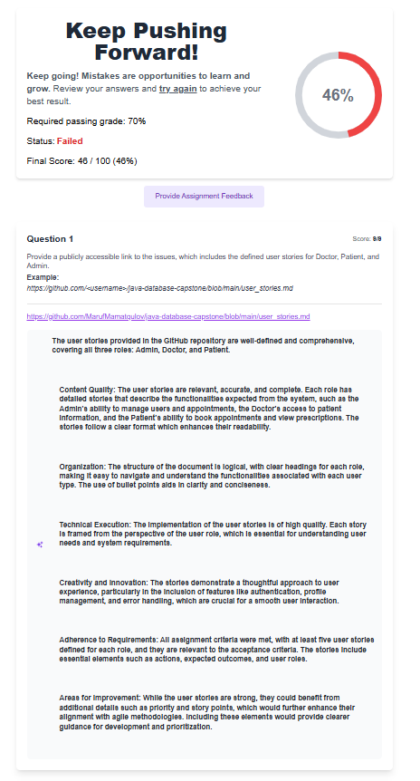

# Smart Clinic Management System (Backend)

This repository contains a Java Spring Boot backend for a Smart Clinic Management System with JWT authentication, MySQL database, and role-based access (ADMIN, DOCTOR, PATIENT).

## What I added locally
- Spring Boot application with JPA entities: `User`, `Doctor`, `Patient`, `Appointment`, `Prescription`.
- Repositories for each entity.
- Services: `UserService`, `DoctorService`, `PatientService`, `AppointmentService`, `PrescriptionService`, `TokenService`.
- Controllers: `AuthController`, `DoctorController`, `PatientController`, `AppointmentController`, `PrescriptionController`.
- Security: `JwtUtil`, `JwtAuthenticationFilter`, `SecurityConfig` (BCrypt encoder, stateless JWT-based security).
- Stored procedures documented in `src/main/resources/schema-design.md`.
- Dockerfile (multi-stage) and GitHub Actions workflow `./github/workflows/compile-backend.yml`.

## Quick local setup (Windows, PowerShell)
1. Install Java 17 and Maven. Verify:
   ```powershell
   java -version
   mvn -version
   ```

2. Create MySQL database and user (example):
   ```sql
   CREATE DATABASE smart_clinic;
   CREATE USER 'clinic'@'localhost' IDENTIFIED BY 'yourpassword';
   GRANT ALL PRIVILEGES ON smart_clinic.* TO 'clinic'@'localhost';
   FLUSH PRIVILEGES;
   ```

3. Configure database connection in `backend/src/main/resources/application.properties` or set environment variables:
   - `spring.datasource.url`
   - `spring.datasource.username`
   - `spring.datasource.password`
   - `app.jwt.secret` must be at least 32 characters for HS256

4. Build and run the backend:
   ```powershell
   cd "c:\Users\Marufjon\Documents\Doctor smart\backend"
   mvn clean package
   java -jar target/*.jar
   ```
   or in development:
   ```powershell
   mvn spring-boot:run
   ```

5. Test endpoints with curl or Postman. Example register/login:
   ```bash
   curl -X POST http://localhost:8080/api/auth/register -H "Content-Type: application/json" -d '{"username":"admin","password":"pass123","email":"admin@example.com","role":"ADMIN"}'

   curl -X POST http://localhost:8080/api/auth/login -H "Content-Type: application/json" -d '{"username":"admin","password":"pass123"}'
   ```

## Creating & Uploading to GitHub (step-by-step)
1. Initialize a git repository (if not already):
   ```powershell
   cd "c:\Users\Marufjon\Documents\Doctor smart"
   git init
   git add .
   git commit -m "Initial Smart Clinic backend scaffold"
   ```

2. Create a remote repository on GitHub (example: `java-database-capstone`) via GitHub UI.

3. Add the remote and push:
   ```powershell
   git remote add origin https://github.com/<your-username>/java-database-capstone.git
   git branch -M main
   git push -u origin main
   ```

4. Obtain direct file links for assignment submission (GitHub blob URLs):
   - Open your GitHub repo in the browser.
   - Navigate to the file, for example `backend/src/main/java/com/project/back_end/models/Appointment.java`.
   - Click the file; the URL will look like:
     `https://github.com/<your-username>/java-database-capstone/blob/main/backend/src/main/java/com/project/back_end/models/Appointment.java`
   - Use that URL in your assignment form.

## Assignment-specific items (from screenshots)
- Provide blob URLs for files requested (controllers, services, repositories, Dockerfile, workflow). Use the format above.
- For SQL output questions (show `SHOW TABLES`, SELECT, stored procedure calls):
  - Run a local MySQL client and execute the SQL commands.
  - Copy the output rows and paste them into the assignment text fields.

Example `SHOW TABLES` output:
```
+--------------------+
| Tables_in_smart_clinic |
+--------------------+
| users              |
| doctors            |
| patients           |
| appointments       |
| prescriptions      |
+--------------------+
```

Example stored procedure call (MySQL):
```
```

## How to produce screenshots requested
- Start the backend and seed some data (register users, create doctors, patients, appointments).
- Open the frontend (if created) or use Postman to show the UI responses.
- Take screenshots of the admin/doctor/patient portal login pages or actions.

## Docker build and run
1. Build Docker image (from `backend` folder):
   ```powershell
   docker build -t smart-clinic-backend:1.0 .
   ```
2. Run container (link to local MySQL or use docker-compose):
   ```powershell
   docker run -e SPRING_DATASOURCE_URL="jdbc:mysql://host.docker.internal:3306/smart_clinic" -e SPRING_DATASOURCE_USERNAME=clinic -e SPRING_DATASOURCE_PASSWORD=yourpassword -p 8080:8080 smart-clinic-backend:1.0
   ```

## GitHub Actions
- I added `.github/workflows/compile-backend.yml` — on push to `main` it will run `mvn clean package` and `mvn test`. Ensure your repo has tests or set `-DskipTests=true` if you prefer.

## What I can do next for you
- Scaffold the React frontend (Vite or CRA) with role-based routing and sample pages.
- Add DTOs and ControllerAdvice improvements.
- Add Flyway migrations to run stored procedures automatically.
- Create unit tests for services and controllers.

If you want, I can now:
- Create the frontend scaffold and implement login + role-based routes.
- Or finish adding tests and migrations.

Tell me which next step you want me to implement now, or confirm if you want only the upload instructions and file links (I can also generate exact blob URLs for the files I created if you push to GitHub).